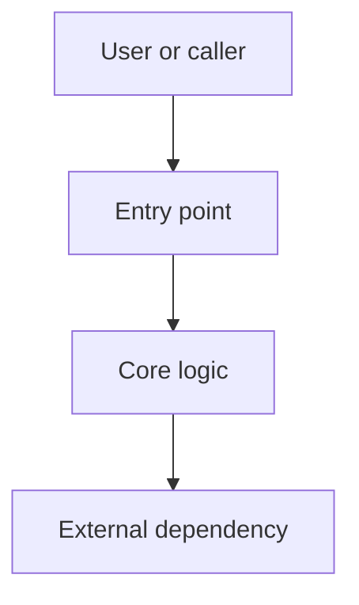

# [Project Name] Project Understanding

Replace all placeholders before finalizing. Use `未確認`, `該当なし`, or `要確認` rather than leaving blank cells or empty bullets. Remove the Mermaid example if it does not clarify the project.

## Summary

- Purpose:
- Primary users or use cases:
- Current confidence:

## Quick Start For New Contributors

- Read first:
- Run locally:
- Run tests:
- Useful commands:

## Technology Stack

| Area | Technology | Evidence |
|---|---|---|
| Runtime |  |  |
| Frameworks |  |  |
| Package/build |  |  |
| Test tools |  |  |
| Storage/integrations |  |  |

## Repository Structure

| Path | Role |
|---|---|
| `path/` |  |

## Architecture Overview

Describe the main modules, boundaries, and dependency direction. Include a diagram only when it improves understanding.

## Main Workflows

### [Workflow Name]

- Entry point:
- Key files:
- Flow:
- Validation or tests:

## Key Files And Symbols

| File or symbol | Why it matters |
|---|---|
| `path/to/file` |  |

## Configuration And Operations

- Environment variables:
- Config files:
- Build/deploy notes:
- Logging/observability:

## Testing Strategy

- Test locations:
- What is well covered:
- Gaps or unknowns:
- Recommended validation commands:

## Risks, Gaps, And Open Questions

| Item | Evidence | Follow-up |
|---|---|---|
|  |  |  |

## Suggested Reading Order

1. `README.md`
2. `path/to/entrypoint`
3. `path/to/core/module`
