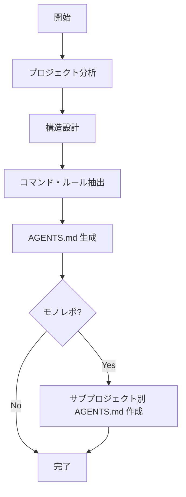

# AGENTS.md 作成スキル

## 概要

`AGENTS.md` はAIコーディングエージェントのためのガイドファイルであり、プロジェクトでエージェントが効果的に作業するための コンテキストと指示を提供する。人間向けの README とは異なり、ビルド手順、テスト、コーディング規約など、エージェント特有の情報を含める。

## ワークフロー



### フェーズ1: プロジェクト分析

プロジェクトの以下の情報を分析・収集する:

1. **プログラミング言語・フレームワーク** - メイン言語、使用フレームワーク
2. **パッケージマネージャー** - npm, yarn, pnpm, bundler, pip, cargo 等
3. **ビルドシステム** - webpack, vite, turbo, make, rake 等
4. **テストフレームワーク** - jest, rspec, pytest, cargo test 等
5. **リンター・フォーマッター** - eslint, rubocop, prettier, black 等
6. **CI/CD** - GitHub Actions, GitLab CI 等
7. **プロジェクト構成** - モノレポかシングルプロジェクトか

情報源として以下を確認:
- `package.json`, `Gemfile`, `Cargo.toml`, `pyproject.toml` 等の依存管理ファイル
- `Makefile`, `Rakefile`, `Taskfile.yml` 等のタスクランナー
- `.eslintrc`, `.rubocop.yml`, `.prettierrc` 等の設定ファイル
- `.github/workflows/` 等のCI設定
- 既存の `README.md`, `CONTRIBUTING.md`

### フェーズ2: 構造設計

収集した情報をもとに、含めるセクションを決定する。

#### 標準セクション構成

| セクション | 必須 | 内容 |
|-----------|------|------|
| Project overview | ○ | プロジェクトの概要とアーキテクチャ |
| Dev environment setup | ○ | 開発環境のセットアップ手順 |
| Build commands | ○ | ビルド・コンパイルコマンド |
| Testing instructions | ○ | テスト実行方法 |
| Code style | △ | コーディング規約・リンター設定 |
| PR instructions | △ | PR/コミット規約 |
| Security considerations | △ | セキュリティに関する注意事項 |
| Architecture | △ | プロジェクトのアーキテクチャ概要 |

詳細は [section-guide.md](references/section-guide.md) を参照。

### フェーズ3: コマンド・ルール抽出

各セクションに記述する具体的なコマンドやルールを抽出する。

**記述ルール:**

- 人間向けの冗長な説明は避ける
- エージェントが直接実行できるコマンドを記述する
- コマンドは完全な形で記述する（例: `npm run test` ではなく `pnpm test -- --watch` のように具体的に）
- プレースホルダーが必要な場合は `<project_name>` 形式を使用する

### フェーズ4: AGENTS.md 生成

テンプレートを参考に `AGENTS.md` を生成する:

| テンプレート | 用途 |
|-------------|------|
| [standard.md](templates/standard.md) | 一般的なプロジェクト |
| [minimal.md](templates/minimal.md) | 小規模・シンプルなプロジェクト |

### フェーズ5: モノレポ対応

大規模なモノレポの場合、ルートの `AGENTS.md` に加えて、サブプロジェクトごとにネストされた `AGENTS.md` を作成する:

```
monorepo/
├── AGENTS.md              # ルート: 全体のビルド、CI、共通規約
├── packages/
│   ├── frontend/
│   │   └── AGENTS.md      # フロントエンド固有の指示
│   ├── backend/
│   │   └── AGENTS.md      # バックエンド固有の指示
│   └── shared/
│       └── AGENTS.md      # 共有ライブラリ固有の指示
```

- ルート `AGENTS.md`: 全体のビルド・CI・共通規約を記述
- サブプロジェクト `AGENTS.md`: そのプロジェクト固有のビルド・テスト・規約を記述

## 記述原則

1. **簡潔性**: エージェントが直接理解・実行できる形式で書く
2. **具体性**: 曖昧なガイドラインではなく、具体的なコマンドやルールを記述
3. **標準Markdown**: 標準的なMarkdown記法を使用
4. **技術的正確性**: コマンドやパスは正確に記述
5. **最新性**: プロジェクトの現状を反映した内容にする

## ファイル出力

作成した内容を `AGENTS.md` として保存する。モノレポの場合は、各サブプロジェクトにもそれぞれ `AGENTS.md` を配置する。
