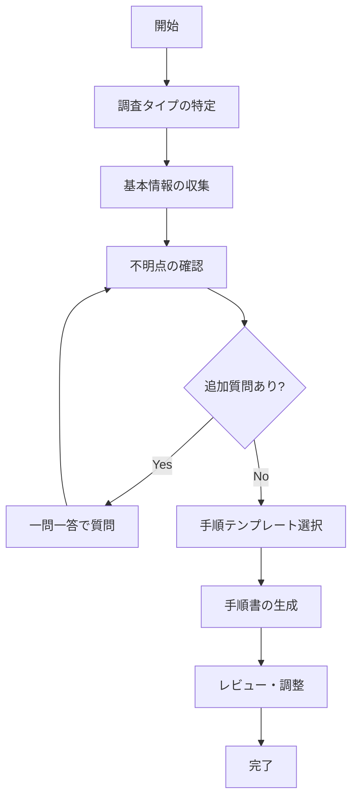

# システム調査手順生成スキル

## 概要

システム運用・保守において、障害調査、動作確認、構成調査などの手順書を効率的に作成するためのスキル。調査目的に応じたテンプレートを提供し、**一問一答形式で不明点を解消しながら**実行可能な手順書を生成する。

## ワークフロー



## 調査タイプ

| タイプ | 説明 | テンプレート |
|--------|------|-------------|
| 障害・不具合調査 | 発生した問題の原因特定 | [`templates/incident.md`](templates/incident.md) |
| 動作確認・検証 | 正常動作の確認 | [`templates/verification.md`](templates/verification.md) |
| 構成調査 | システム構成・設定の調査 | [`templates/configuration.md`](templates/configuration.md) |

## 一問一答形式のガイドライン

### 原則

1. **一度に1つの質問のみ**: 回答を得てから次の質問へ
2. **具体的な質問**: Yes/No または短い回答で答えられる形式
3. **依存関係の考慮**: 前の回答に基づいて次の質問を調整
4. **確認の反復**: 不明点があれば再度確認

### 質問の流れ（障害調査の例）

```
Claude: 「調査対象のシステム名は何ですか？」
User: 「受注管理システム」

Claude: 「どのような事象が発生していますか？」
User: 「画面がエラーになって注文が登録できない」

Claude: 「エラーメッセージは表示されていますか？ある場合は内容を教えてください」
User: 「"DB接続エラー" と表示されている」

Claude: 「この事象はいつから発生していますか？」
User: 「今日の14時頃から」

Claude: 「14時頃に何か変更作業やリリースはありましたか？」
User: 「13時にDBサーバーのパッチ適用があった」

...（続く）
```

### 確認すべきパターン

以下のような不明確・曖昧な情報は追加質問で明確にする：

- **曖昧な表現**: 「動かない」「おかしい」「遅い」など
- **具体的な数値がない**: 「最近」「たまに」「いくつか」など
- **前提条件の不明確さ**: 環境、タイミング、操作手順など
- **影響範囲の不明確さ**: 誰が/どこで/どの程度影響を受けているか

### 回答が不明確な場合

```
Claude: 「"たまに発生する" とのことですが、もう少し具体的に教えてください。
        例えば、1日に何回程度、あるいは特定の時間帯に発生しますか？」

Claude: 「"システムが遅い" について確認させてください。
        どの画面/機能で遅いと感じますか？また、通常と比べて何秒（何倍）程度遅いですか？」
```

## 情報収集

### 必須情報

1. **調査目的**: 何を明らかにしたいか？
2. **対象システム**: どのシステム/コンポーネントを調査するか？
3. **発生日時**: いつ発生した/確認された事象か？（障害の場合）
4. **緊急度**: どの程度急いでいるか？

### 障害調査の場合

1. **事象**: 具体的に何が起きているか？
2. **影響範囲**: どの程度の範囲に影響しているか？
3. **再現性**: 常に発生するか、断続的か？
4. **エラーメッセージ**: エラーログや画面メッセージはあるか？
5. **直前の変更**: 発生前に変更作業はあったか？

### 動作確認の場合

1. **確認項目**: 何を確認したいか？
2. **期待動作**: 正常な場合の挙動は？
3. **確認条件**: どのような条件で確認するか？

### 構成調査の場合

1. **調査項目**: 何を調べたいか？
2. **調査範囲**: どこまでを対象とするか？
3. **出力形式**: どのような形式で報告するか？

## 手順書の構成要素

### 基本セクション

1. **概要**: 調査の目的と背景
2. **対象**: 調査対象のシステム/環境
3. **前提条件**: 調査開始前に必要な条件
4. **手順**: ステップバイステップの調査手順
5. **確認ポイント**: 各ステップでの確認事項
6. **結果記録**: 調査結果の記録方法
7. **注意事項**: 調査時の注意点

### 手順記述のガイドライン

- **具体的なコマンド**: 実行コマンドは正確に記載
- **確認観点**: 何を見るべきか明示
- **判断基準**: 正常/異常の判断基準を記載
- **分岐**: 結果に応じた次のアクションを記載

## ベストプラクティス

### 調査の心構え

1. **事実ベース**: 推測ではなく証拠に基づく
2. **記録を残す**: 実行したコマンドと結果を記録
3. **一度に一つ**: 複数の変更を同時に行わない
4. **影響確認**: 調査作業がシステムに与える影響を考慮

### 手順書作成のポイント

1. **再現可能**: 誰が実行しても同じ結果になる
2. **判断明確**: 次に何をすべきか明確
3. **ロールバック**: 問題発生時の対処を記載
4. **承認フロー**: 必要な承認プロセスを明記

## ファイル出力

作成した手順書は以下の形式で保存：

1. **Markdown形式**: `.md` ファイルとして保存
2. **Word形式**: docxスキルと連携して `.docx` として出力

