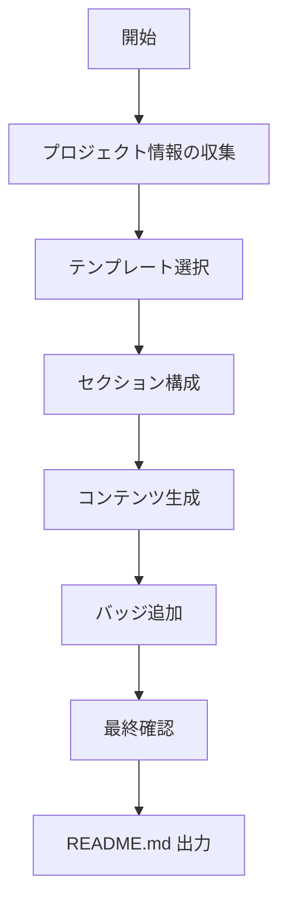

# GitHub README.md 作成スキル

## 概要

GitHubプロジェクトのREADME.mdは、プロジェクトの「顔」として機能する最も重要なドキュメントである。このスキルを使用して、ベストプラクティスに基づいた魅力的なREADMEを作成する。

## ワークフロー



### フェーズ1: プロジェクト情報の収集

以下の情報を確認する：

1. **プロジェクト名**: リポジトリ/ソフトウェアの名前
2. **概要**: 一文で説明できるプロジェクトの目的
3. **主な機能**: 3〜5個の主要機能
4. **技術スタック**: 使用言語・フレームワーク
5. **対象ユーザー**: 誰のためのプロジェクトか
6. **ライセンス**: MIT, Apache 2.0, GPL など

### フェーズ2: テンプレート選択

プロジェクトタイプに応じたテンプレートを選択：

| タイプ | テンプレート | 使用場面 |
|--------|------------|---------|
| 標準 | [`templates/standard.md`](templates/standard.md) | 一般的なOSSプロジェクト |
| 最小 | [`templates/minimal.md`](templates/minimal.md) | 小規模・シンプルなツール |

### フェーズ3: セクション構成

#### 必須セクション

1. **ヘッダー**
   - プロジェクト名（ロゴがあれば追加）
   - 一行説明（tagline）
   - バッジ（ビルド状態、ライセンス等）

2. **概要（About）**
   - プロジェクトの目的
   - 解決する課題
   - 主な特徴（3〜5個）

3. **インストール**
   - 前提条件
   - インストール手順（コマンド例付き）

4. **使用方法（Usage）**
   - 基本的な使い方
   - コード例
   - スクリーンショット/GIF（推奨）

5. **ライセンス**
   - ライセンス種別と簡潔な説明

#### 推奨セクション

- **デモ**: ライブデモへのリンク、GIF
- **ドキュメント**: 詳細ドキュメントへのリンク
- **コントリビューション**: 貢献ガイドライン
- **ロードマップ**: 今後の計画
- **FAQ**: よくある質問
- **謝辞**: 利用ライブラリ、貢献者への感謝

## バッジガイド

バッジはプロジェクトの状態を視覚的に伝える。詳細は [`badges.md`](badges.md) を参照。

### 主要バッジ

```markdown
<!-- ビルド状態 -->


<!-- ライセンス -->


<!-- バージョン -->


<!-- ダウンロード数 -->

```

## ベストプラクティス

### コンテンツ

1. **簡潔に**: 最初の数行で価値を伝える
2. **具体的に**: 曖昧な表現を避け、具体例を示す
3. **コピー可能に**: コマンドはコピーして使える形式で
4. **最新に**: 定期的に情報を更新する

### ビジュアル

1. **ロゴ/バナー**: プロジェクトの印象を強める
2. **スクリーンショット**: 実際の動作を見せる
3. **GIF/動画**: 複雑な操作はアニメーションで説明
4. **適切な見出し**: スキャンしやすい構造

### フォーマット

1. **目次**: 長いREADMEには必須
2. **コードブロック**: 言語指定でシンタックスハイライト
3. **リスト**: 箇条書きで情報を整理
4. **リンク**: 関連リソースへの参照

## ファイル出力

作成したREADMEは `README.md` として保存する。

## サンプル

実際のREADME例は [`examples/`](examples/) ディレクトリを参照。
