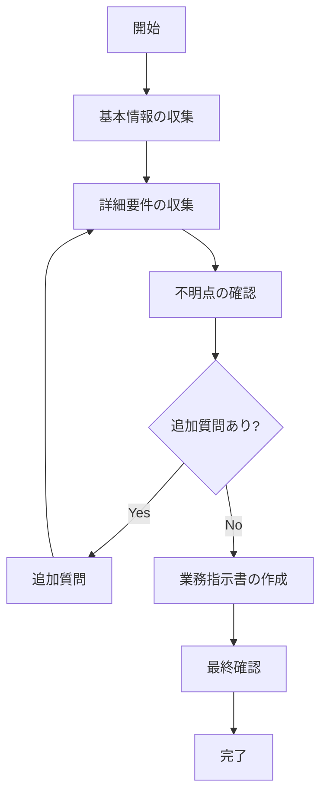

# 業務指示作成スキル

## 概要

このスキルは、業務指示を出す際に必要な情報を一問一答形式で収集し、明確で実行可能な業務指示書を作成するためのワークフローを提供する。

## ワークフロー



### フェーズ1: 基本情報の収集

以下の項目について**一問一答形式**で質問する。一度に複数質問しない。

1. **目的**: この業務の目的・ゴールは何か？
2. **担当者**: 誰がこの作業を実行するか？
3. **期限**: いつまでに完了する必要があるか？
4. **背景**: なぜこの業務が必要か？（任意）

### フェーズ2: 詳細要件の収集

基本情報をもとに、詳細を掘り下げる。

1. **成果物**: 期待する成果物は何か？（形式・数量・品質）
2. **手順**: 具体的な作業手順があるか？
3. **制約条件**: 予算・リソース・技術的制約はあるか？
4. **参考資料**: 参照すべき資料やドキュメントはあるか？

### フェーズ3: 不明点の確認

収集した情報をもとに、不明点や曖昧な点を特定して確認する。

**確認すべきパターン**:
- 曖昧な表現（「適切に」「なるべく」など）
- 具体的な数値がない項目
- 前提条件の不明確さ
- 例外ケースの扱い

## 一問一答形式のガイドライン

### 原則

1. **一度に1つの質問のみ**: 回答を得てから次の質問へ
2. **具体的な質問**: Yes/No または短い回答で答えられる形式
3. **依存関係の考慮**: 前の回答に基づいて次の質問を調整
4. **確認の反復**: 不明点があれば再度確認

### 質問の流れ

```
Claude: 「この業務の目的は何ですか？」
User: 「○○システムの仕様書を作成すること」

Claude: 「この作業の担当者は誰ですか？」
User: 「開発チームの田中さん」

Claude: 「期限はいつまでですか？」
User: 「来週金曜日」

Claude: 「仕様書のフォーマットに指定はありますか？（例：Word、Markdown など）」
User: 「Wordで」

...（続く）
```

### 回答が不明確な場合

```
Claude: 「"なるべく早く" とのことですが、具体的な日付はありますか？
        例えば、今週中、来週中などで指定いただけますか？」
```

## 業務指示書テンプレート

### 基本テンプレート

質問で収集した情報をもとに、以下の形式で出力する：

```markdown
# 業務指示書

## 基本情報
- **件名**: [タイトル]
- **作成日**: [日付]
- **担当者**: [名前/チーム]
- **期限**: [日付]

## 目的
[業務の目的・ゴール]

## 背景
[なぜこの業務が必要か]

## 成果物
[期待する成果物の詳細]

## 作業内容
1. [手順1]
2. [手順2]
3. [手順3]

## 制約条件・注意事項
- [制約1]
- [制約2]

## 参考資料
- [資料1]
- [資料2]

## 確認事項
- [ ] [確認項目1]
- [ ] [確認項目2]
```

## ファイル出力

作成した業務指示書は以下の形式で保存可能：

1. **Markdown形式**: `.md` ファイルとして保存
2. **Word形式**: docxスキルと連携して `.docx` として出力

## ベストプラクティス

1. **具体的に記述**: 曖昧な表現を避け、定量的に記述
2. **完了条件を明確に**: 何をもって完了とするか定義
3. **例外ケースの考慮**: イレギュラー時の対応を記載
4. **確認項目の設定**: 作業後のチェックリストを用意
